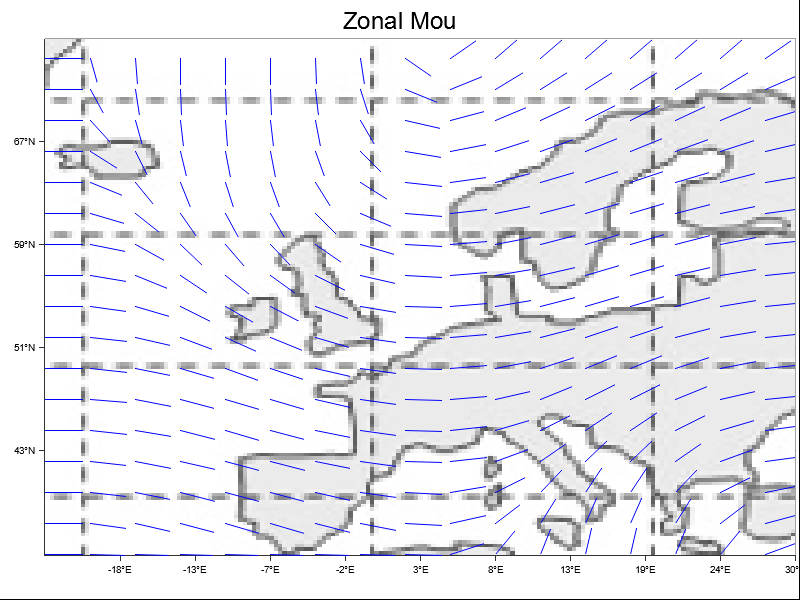

# NWP Regime Analyzer 🌍

> Analyseur de régimes météorologiques pour l'Europe

[](https://www.rust-lang.org/)
[](https://github.com/plotters-rs/plotters)
[](https://opensource.org/licenses/MIT)

Un projet personnel né de ma passion pour la météorologie, visant à mettre en pratique et visualiser les concepts de régimes météorologiques en Europe. Ce projet implémente les modèles théoriques décrits dans l'ouvrage de référence "Concepts et méthodes pour le météorologiste - Tome 1 : Les savoirs : modèles conceptuels et données disponibles" de Christophe Calas.

Ce travail me sert de mémo pratique et d'outil d'apprentissage pour approfondir ma compréhension des différents régimes météorologiques qui influencent le climat européen.



## 📚 Inspiration et Sources

Ce projet s'appuie sur les concepts théoriques développés dans l'ouvrage de Christophe Calas, notamment :
- La classification basée sur le géopotentiel à 700 hPa (Ayrault et al., 1995)
- Les quatre grands régimes de temps caractéristiques de l'Europe
- Les mécanismes dynamiques de chaque configuration atmosphérique

## ✨ Fonctionnalités

- 🌪️ **Analyse Multi-Régimes**: Prise en charge de quatre régimes météorologiques distincts :
    - Régime Zonal
    - Régime de Blocage
    - Anticyclone Groenlandais
    - Régime Zonal Mou
- 📊 **Visualisations HD**: Génération de cartes détaillées avec champs de vents
- 🎯 **Résolution Personnalisable**: Configuration flexible de la grille d'analyse
- 🎨 **Rendu Vectoriel**: Ajustement automatique de la densité et de l'échelle des vecteurs

## 🚀 Pour Démarrer

### Prérequis

- Rust (version stable récente)
- Dépendances à ajouter dans votre `Cargo.toml` :
  ```toml
  [dependencies]
  plotters = "latest"
  image = "latest"
  ```

### Installation

1. Clonez le dépôt :
   ```bash
   git clone https://github.com/LukaChassaing/nwp_regime_analyser.git
   cd nwp_regime_analyser
   ```

2. Compilez le projet :
   ```bash
   cargo build --release
   ```

### Utilisation

1. Assurez-vous d'avoir un fichier `europe_map.png` dans votre répertoire
2. Lancez le programme :
   ```bash
   cargo run --release
   ```

Le programme générera quatre fichiers PNG, un pour chaque régime :
- `regime_zonal.png`
- `regime_blocage.png`
- `regime_anticyclone.png`
- `regime_zonal_mou.png`

## 🌈 Les Régimes Météorologiques

### 🌬️ Régime Zonal
- Vents d'ouest puissants sur l'Europe
- Intensité maximale entre 47°N et 53°N
- Lignes de flux parallèles caractéristiques

### 🏔️ Régime de Blocage
- Anticyclone sur l'Europe centrale
- Déviation du flux d'ouest habituel
- Création d'un schéma de vent circulaire

### ❄️ Anticyclone Groenlandais
- Système de haute pression près du Groenland
- Impact sur les flux de l'Atlantique Nord
- Influence sur les systèmes météorologiques européens

### 🌥️ Régime Zonal Mou
- Intensité réduite des vents d'ouest
- Configuration ondulante du flux
- Directions de vent variables

## 🛠️ Détails Techniques

Le projet utilise une approche basée sur une grille avec les composants suivants :

- `WeatherAnalyzer`: Composant principal pour la génération des régimes
- `WeatherPlotter`: Gestion de la visualisation avec plotters
- `WeatherFields`: Structure de données pour les variables atmosphériques
- `RegimeType`: Enum définissant les différents types de régimes

## 🤝 Contribution

Les contributions sont les bienvenues ! N'hésitez pas à soumettre une Pull Request.

## 📜 Licence

Ce projet est sous licence MIT - voir le fichier LICENSE pour plus de détails.

## 👏 Remerciements

- Basé sur les principes décrits dans l'ouvrage "Concepts et méthodes pour le météorologiste" de Christophe Calas
- Utilise la bibliothèque plotters pour des visualisations scientifiques de qualité
- Implémente les classifications d'Ayrault et al. (1995)
- Projet né d'une passion pour la compréhension des phénomènes météorologiques

## 📖 Références

```bibtex
@book{calas2014concepts,
  title={Concepts et méthodes pour le météorologiste: Tome 1: Les savoirs: modèles conceptuels et données disponibles},
  author={Calas, Christophe},
  year={2014},
  publisher={Météo-France}
}
```